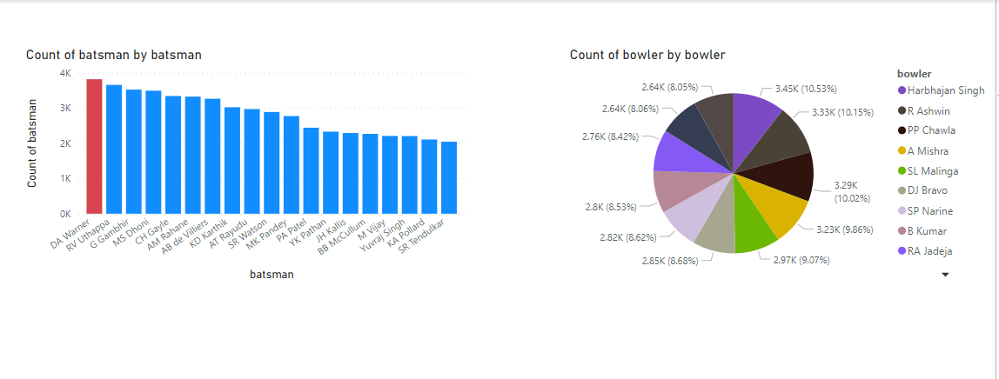
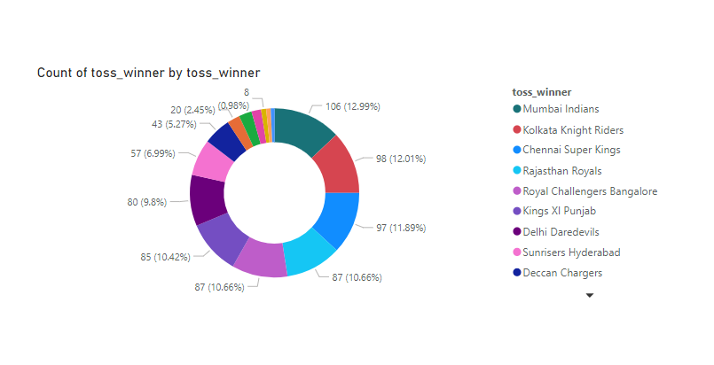
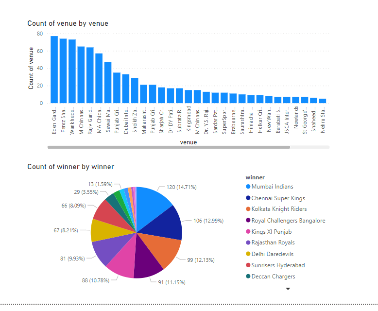

**Introduction to PowerBI**
 - Power BI components.
 - Building blocks in PowerBI
 - Types of Power BI storage modes.
-  IPL Data Visualisation with Power BI.

**Why do we need PowerBI?**
   - Being into taxi business, the owners wanted to cut short the number of accidents in which their company is involved.
   - Considering the given situation, where there was a budget constraint but the expectations were too high. Microsofts' Power BI is what we suggested to them.
   - Regreesion analysis can be done about the data, and solve basic questions about why and when

**What is PowerBI**
 - Business analytics and visualisation tool.
 - Interactive dashboard, Power BI reports,
 - SQL , Oracle, Kaggle, other datasets supported.

**What is the use of PowerBI**
 - Technical Professionals
 - Data Analysts.

**Components of PowerBI**
 - Power BI desktop - free desktop application.
 - Power BI gateway - b/w cloud report, datasets and local environment connection
 - PowerBI mobile applications- Windows, IoS and android platforms.
 - PowerBI cloud - Software as a service.

**Building blocks in PowerBI**
1. Visualisation
2. Dashboards - a single screen representation of multiple visualisations.
3. Reports - Collection of visualisations, summary of reports over a time.
4. Datasets - Collection of data
5. Tiles - a single visualisation in a report or a dashboard.

**Types of PowerBI storage modes**
 - Direct query mode - direct connection with a light database, directly comes from data sources.
 - Import mode is very fast as compared to direct query mode - it fetches the data and loads it in cache.

**Key features**
 - tables, parameter, language, themes, paid views, mobile layouts, etc.
 - training videos, etc. on powerBI are available.
 - Different types of dataset imports, excel workbook, cloud service, sql server database, transform data, add queries, dataverse, etc.
 - filters, visualisations, bar chart, matrix, table, R-Chart, etc.

Here I used a basic [IPL data](https://www.kaggle.com/patrickb1912/ipl-complete-dataset-20082020)
 - I basically plotted some pieCharts, barCharts, DonutCharts and reviewed the data.
 - The first dataset is bowl-by-bowl (2008-2020) which has the features:
   - innings, overs, ball, batsman,	non_striker, bowler	, batsman_runs, etc.
   - in all there are 18 attributes and 1,93,469 records.
   - the records are non-null and unique.
 - The second dataset is of IPL Matches from 2008-2020 which has the features:
   - id	city, date, player_of_match, venue, neutral_venue, team1, team2, toss_winner, toss_decision, winner, etc.
   - In all there are 17 columns and 817 records.
 - The plotted charts are given below
---
- Best batsman and bowler in the League

- Toss winners in all the matches of the League

- Biggest Match Winners and stadiums with most number of matches. 
